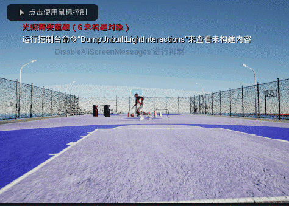
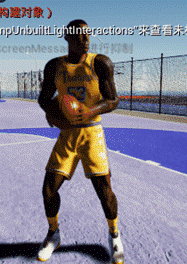

# BasketballSynth

Basketball simulator for synthetic data generation and video rendering.
## Samples

  
  

## Demo
<!-- 放截图/GIF 或视频链接 -->
- Video: ([link](https://drive.google.com/file/d/1E758tiaTuHc6WnYSeNjJxqEJFii-STif/view?usp=drive_link))
- Samples: (images)

## What it provides
- Synthetic basketball scenes
- Configurable camera/lighting
- Export: video / annotations (optional)

## Contact
Haobin Qin (Nagoya Univ.)
